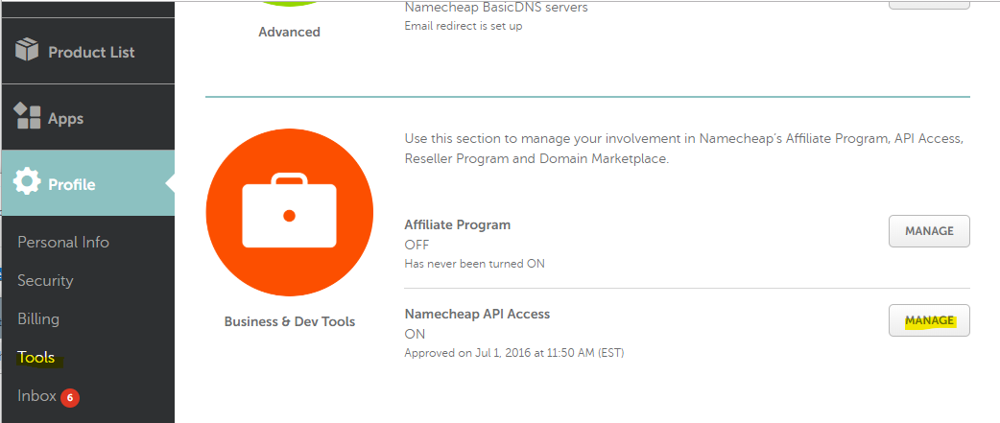
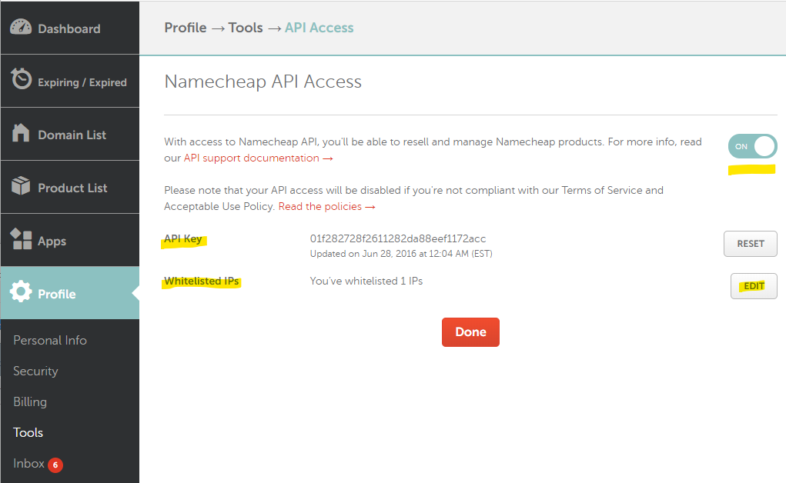

# Running the Namecheap-dot-net tests

To execute or manage the tests in the project,
you'll need to sign up for the [NameCheap Sandbox](https://www.sandbox.namecheap.com/),
obtain an API key, and whitelist the external IP
of the machine from which you'll run the tests.

## Obtain Sandbox API Key

1. Visit [www.sandbox.namecheap.com](https://www.sandbox.namecheap.com/)
   and register for an account. The account name you register with
   will be used for configuration.
2. After signing up, visit your Dashboard, and under [Profile -> Tools](https://ap.www.sandbox.namecheap.com/settings/tools),
   locate the API Access section; click/tap Manage:
   
3. On the NameCheap API page, turn ON the API acces,
   obtain an API key, and whitelist the external IPv4 address
   of the machine from which you'll run the test.
   

For more detailed steps,
see the [NameCheap API Intro page](https://www.sandbox.namecheap.com/support/api/intro.aspx).


## Configure the Test Settings

Making note of the Username you registered with,
the sandbox API key, and the external IPv4,
create a `namecheapdotnet-settings.json` file in the following
location, based on your operating system:

* For Windows, in `c:\Users\<your user>\Documents`;
* For macOS, in your `$HOME` directory, likely `/Users/<your user>`;
* For Linux, in your `$HOME` directory, likely `/home/<your user>`.

The file name should have the following content, replacing the values
of the keys with the appropriate information:

```json
{
  "apiUser": "<username you used to register with the sandbox>",
  "apiKey":  "<API Key for sandbox>",
  "clientIp":  "<external IPv4 of test machine, whitelisted on the sandbox>"
}
```

## Run the tests

You should now be able to run the tests using `dotnet test`
or from within Visual Studio using the Test Explorer.

## Notes

1. Please note that **not all API methods are tested** or
   **not all test are actually executing**. Tests that are not
   reversible, such as registering a new domain name,
   will need to be executed explicitly, from within Visual Studio
   with an understanding of their side-effects.
2. If you already have an account with NameCheap,
   we recommend using a **different username for the sandbox** than
   your main account - this not only enhances security,
   but also reduces confusion. We also recommend that you use,
   when possible, a different email address.
3. You might receive emails from NameCheap at the email address
   you registered with for the sandbox, particularly when running the tests. 
   They may be account access notifications,
   account operation or changes notifications,
   billing, domain expiration, domain renewal, etc.
   All these are normal and a result of: a) running the tests,
   b) security, and
   c) sandbox behaving almost exactly like the main account.  
   Note that you might receiving some of these even a year later,
   in the particular case of having created aka "registered"
   a domain name (domain name registrations are for 1 year).  
   Please note that **there is no billing being done** even
   if you receive invoices for charges.

